# UNIVERSIDAD PERUANA UNIÓN
## FACULTAD DE INGENIERÍA Y ARQUITECTURA
### Escuela Profesional de Ingeniería de Sistemas

# INFORME TÉCNICO FINAL: MIGRACIÓN DE INFRAESTRUCTURA CLOUD - COMERCIAL NOVA

* **Curso:** Virtualización de Servicios Tecnológicos[cite: 2]
* **Docente:** M.Sc. Fredy Abel Huanca Torres
* **Estudiante:** Pawel Armando Paricahua Adco[cite: 2]
* **Ciclo Académico:** VI Ciclo
* **Fecha:** 3 de julio de 2026

---

## 1. INVENTARIO DE RECURSOS CLOUD DESPLEGADOS
Todos los recursos lógicos fueron identificados, documentados y etiquetados dentro del entorno de laboratorio asignado en AWS Academy[cite: 2]:
* 1x VPC Personalizada (`10.0.0.0/16`) con segmentación de subredes[cite: 2].
* 2x Instancias de Cómputo Amazon EC2 (`t2.micro` / `t3.micro`) con Ubuntu Server[cite: 2].
* 1x Instancia de Base de Datos Relacional Amazon RDS (MySQL)[cite: 2].
* 1x Almacenamiento de Objetos Amazon S3 (Bucket con versionado habilitado)[cite: 2].
* 1x Application Load Balancer (ALB) orientado a Internet[cite: 2].
* 1x Dashboard y Alarma de métricas operacionales en Amazon CloudWatch[cite: 2].

---

## 2. CAPA DE RED, DISEÑO Y SEGURIDAD BASE (15% RÚBRICA)
Se estructuró una red lógica aislada mediante Amazon VPC para segmentar los recursos de Comercial Nova[cite: 2]. Las subredes públicas albergan el balanceador y los servidores de cara al público, mientras que las subredes privadas guardan la base de datos de manera hermética[cite: 2].

### 2.1 Segmentación de Red y Subredes
Se configuraron un mínimo de 2 subredes en diferentes zonas de disponibilidad para garantizar la alta disponibilidad[cite: 2].

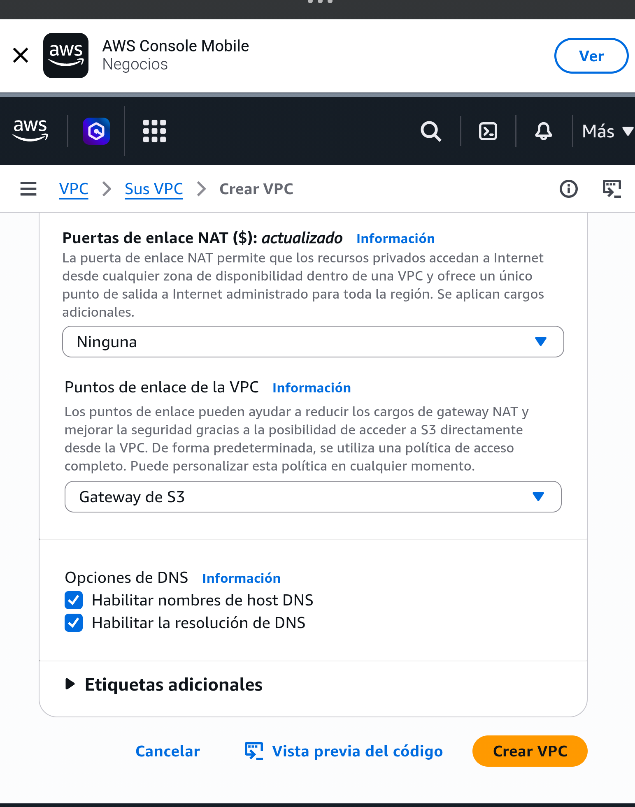
*Figura 1: Evidencia de la planificación y creación de subredes en la VPC[cite: 2].*

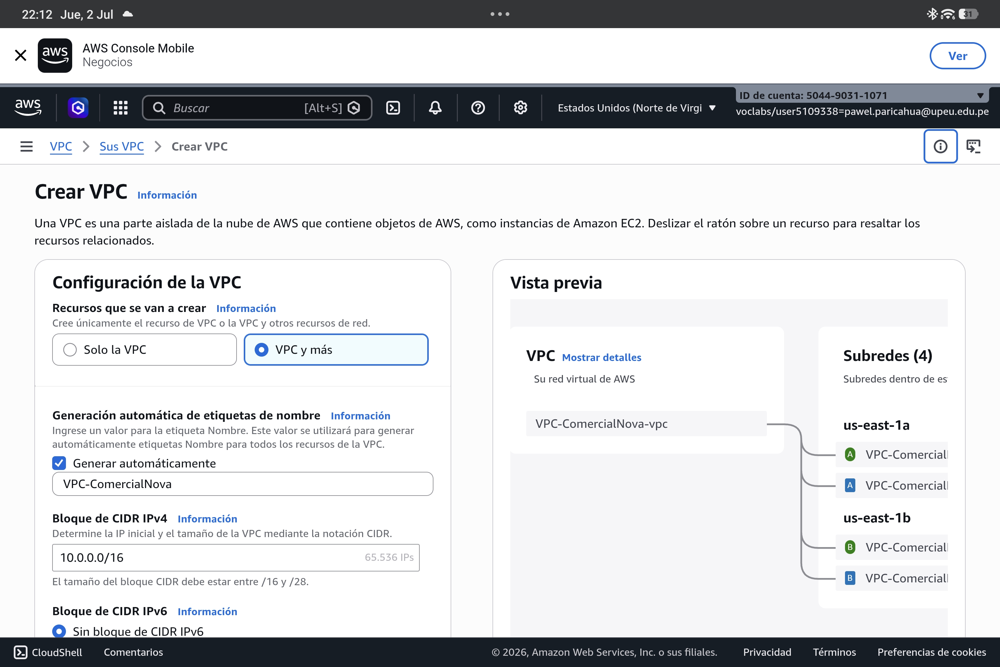
*Figura 2: Proceso de inicialización de la VPC personalizada[cite: 2].*

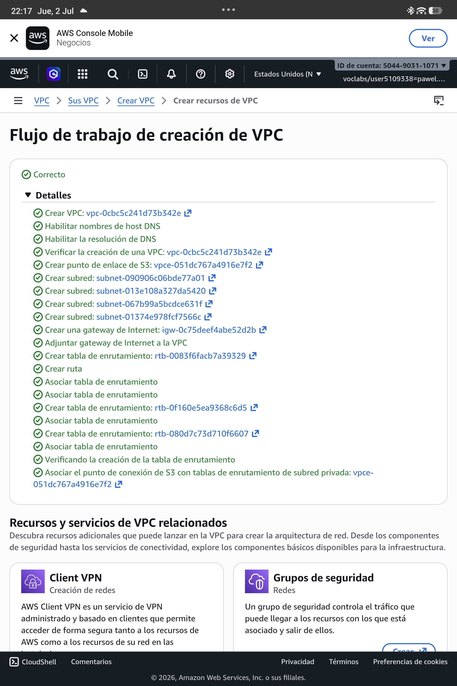
*Figura 3: Confirmación de la infraestructura de red lógica VPC-ComercialNova activa[cite: 2].*

### 2.2 Reglas de Acceso (Security Groups)
Se aplicó el principio de mínimo privilegio en el control de perímetros lógicos de red[cite: 2]:
* El grupo de seguridad de la base de datos (`SG-Database-RDS`) restringe la entrada en el puerto 3306 **exclusivamente** para el identificador del grupo de seguridad de la capa web (`SG-Web-WordPress`), aislándolo de Internet[cite: 2].

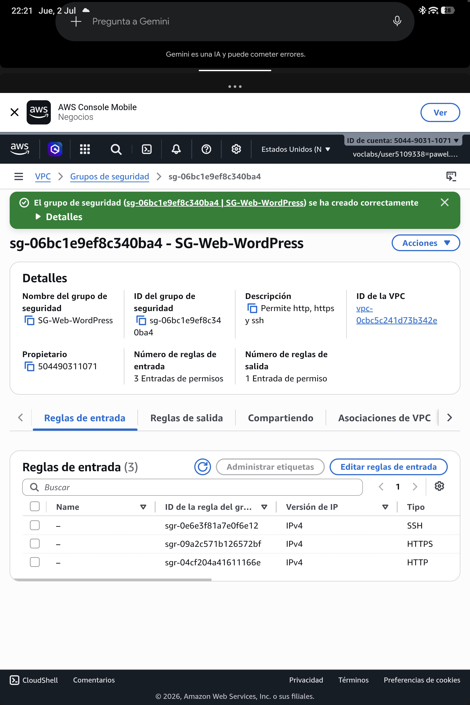
*Figura 4: Reglas de entrada para la capa de cómputo (HTTP, HTTPS y SSH administrado)[cite: 2].*

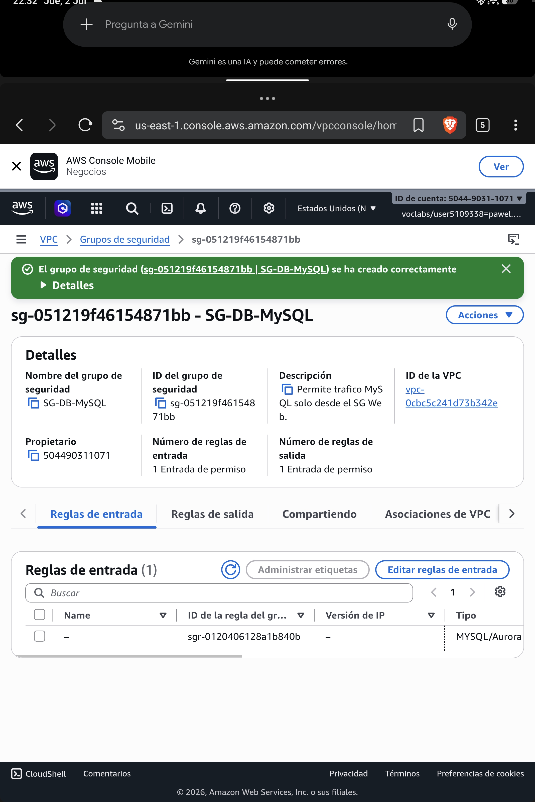
*Figura 5: Regla perimetral del motor RDS restringida únicamente al tráfico de la EC2[cite: 2].*

---

## 3. CAPA DE DATOS Y ALMACENAMIENTO (PERSISTENCIA)
Se desplegó un motor de persistencia relacional MySQL administrado a través de Amazon RDS y un repositorio centralizado de objetos en Amazon S3[cite: 2].

### 3.1 Amazon RDS
La instancia se desplegó desmarcando el acceso público ("Public access: No"), garantizando el aislamiento en el backend[cite: 2].

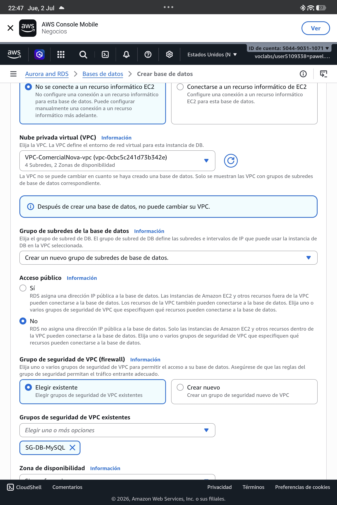
*Figura 6: Estado de aprovisionamiento del motor MySQL en RDS[cite: 2].*

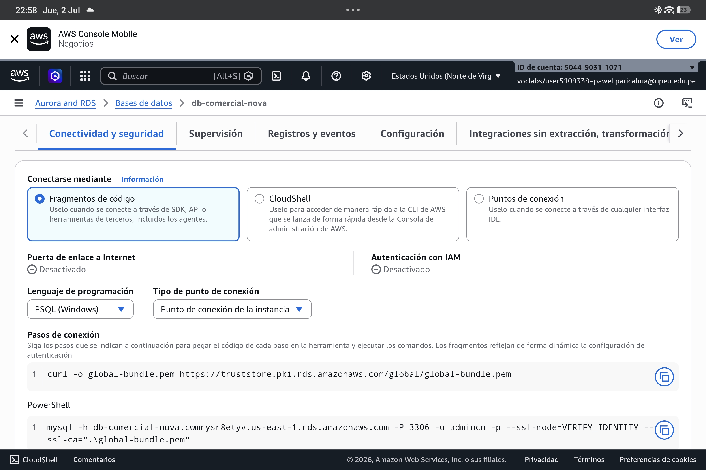
*Figura 7: Recuperación del Endpoint privado de producción de la base de datos[cite: 2].*

### 3.2 Amazon S3
Se habilitó el versionado de objetos para mitigar el riesgo de borrado accidental de archivos multimedia del CMS[cite: 2].

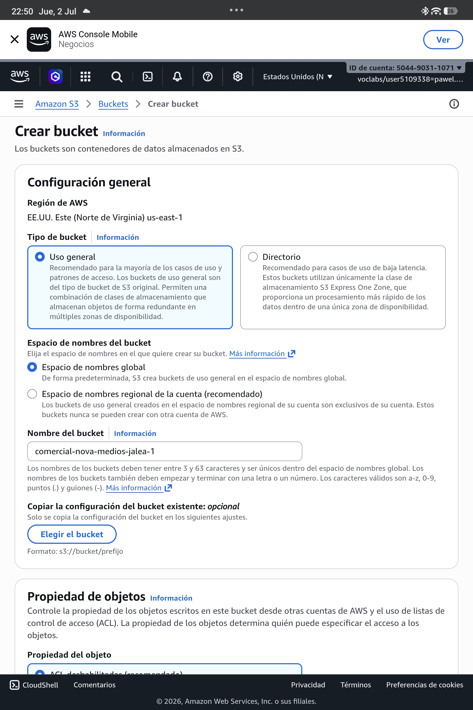
*Figura 8: Aprovisionamiento del bucket privado con políticas de bloqueo de acceso público[cite: 2].*

---

## 4. CAPA DE CÓMPUTO Y DESPLIEGUE DE LA APLICACIÓN (25% RÚBRICA)
Aprovisionamiento del sistema operativo base e inyección del script de despliegue LAMP automatizado para la puesta en marcha de WordPress[cite: 2].

### 4.1 Inicialización del Servidor Web
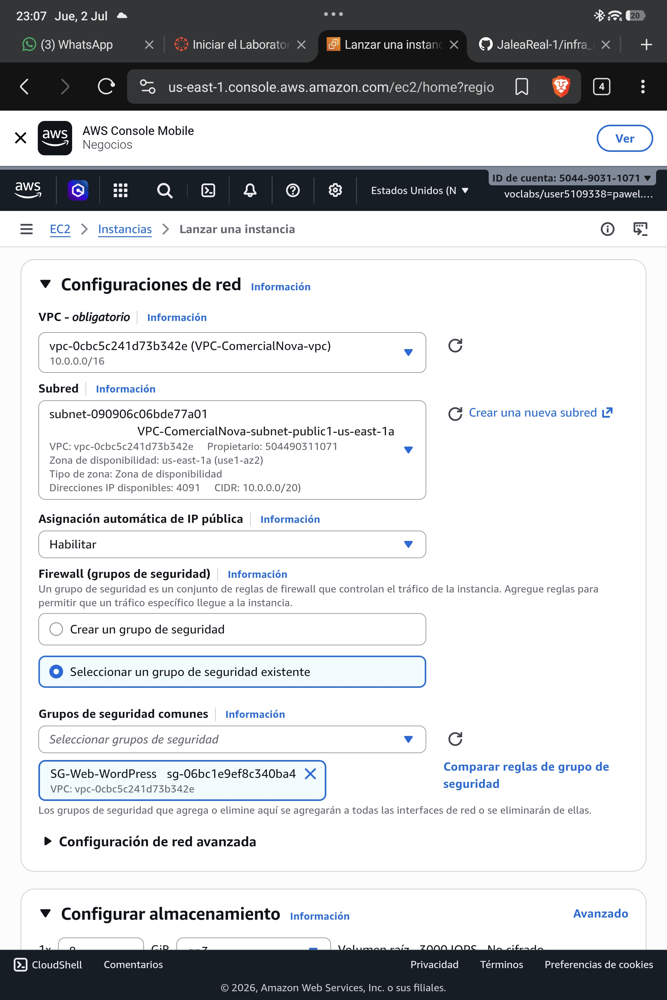
*Figura 9: Despliegue de la instancia virtual de cómputo basada en Ubuntu Server[cite: 2].*

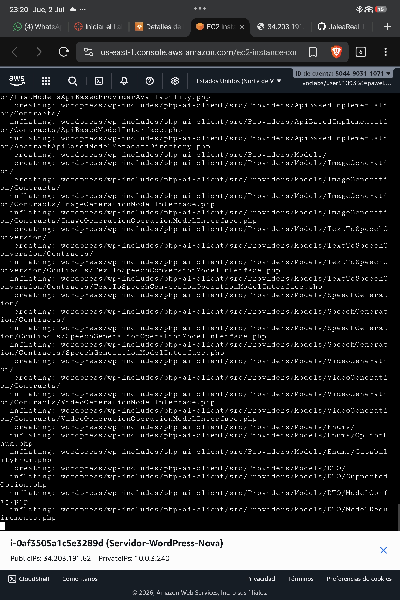
*Figura 10: Establecimiento de control de consola mediante EC2 Instance Connect[cite: 2].*

### 4.2 Configuración y Conexión de WordPress
Se realizó el endurecimiento (hardening) de permisos de directorios a `755` y archivos propiedad de `www-data`[cite: 2].

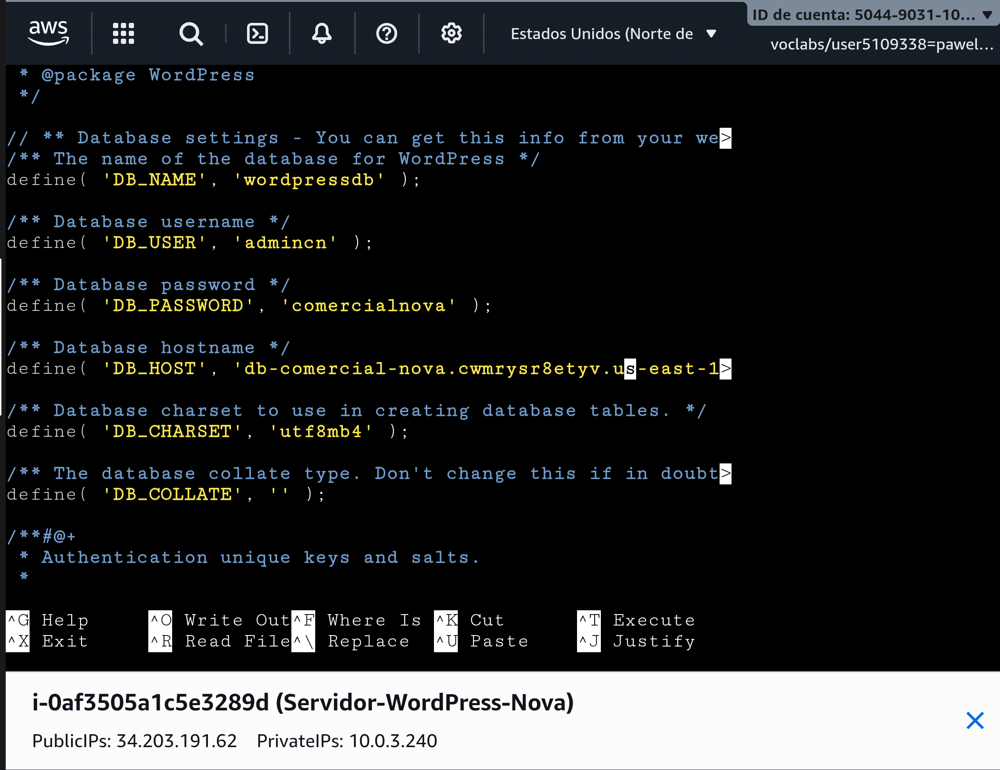
*Figura 11: Modificación del archivo de configuración para apuntar al Endpoint del RDS MySQL[cite: 2].*

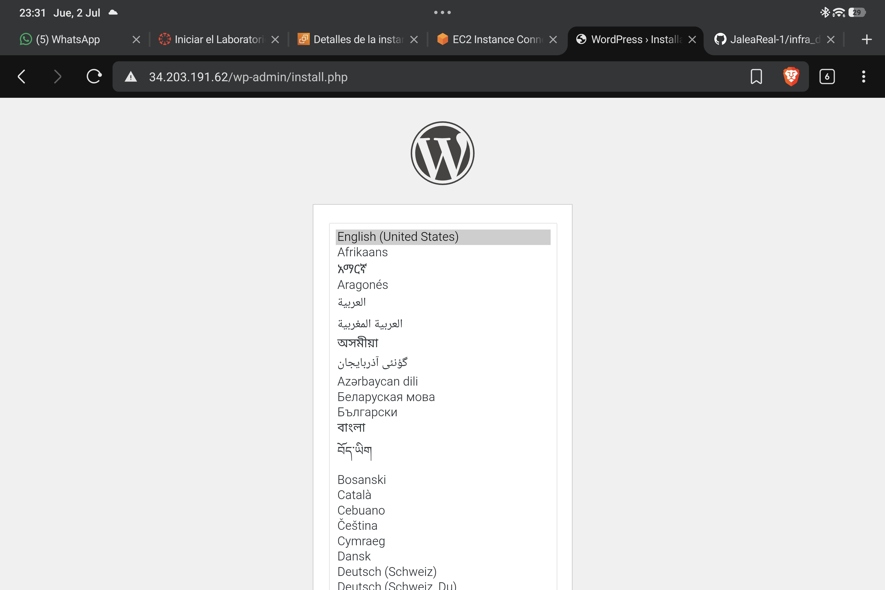
*Figura 12: Validación del stack web respondiendo correctamente a través de la dirección IP pública de la EC2[cite: 2].*

---

## 5. ALTA DISPONIBILIDAD Y ESCALABILIDAD HORIZONTAL (15% RÚBRICA)
Para garantizar la resiliencia operativa y mitigar caídas ante picos de tráfico en Comercial Nova, se procedió al clonado de infraestructura y balanceo de carga en arquitectura Multi-AZ[cite: 2].

### 5.1 Creación de Imagen Inmutable (AMI)
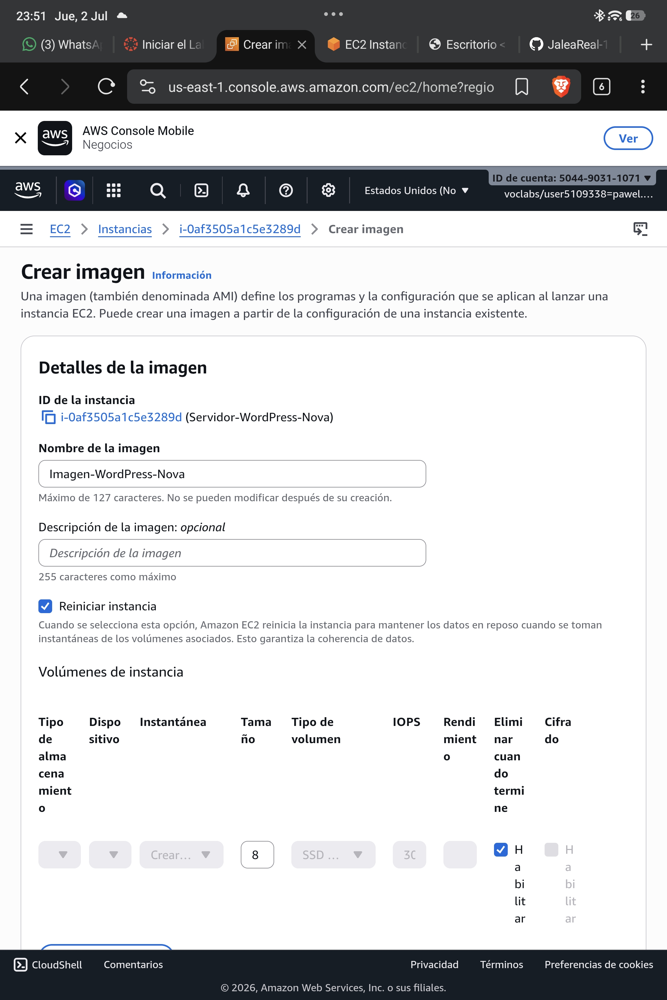
*Figura 13: Creación de la Amazon Machine Image a partir de la EC2 configurada[cite: 2].*

### 5.2 Balanceador de Carga y Target Group
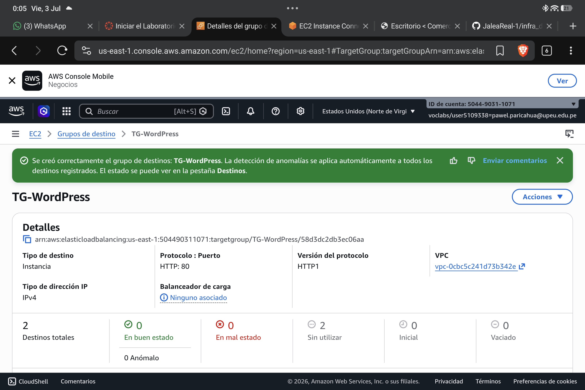
*Figura 14: Asociación de las instancias web gemelas distribuidas en distintas zonas físicas[cite: 2].*

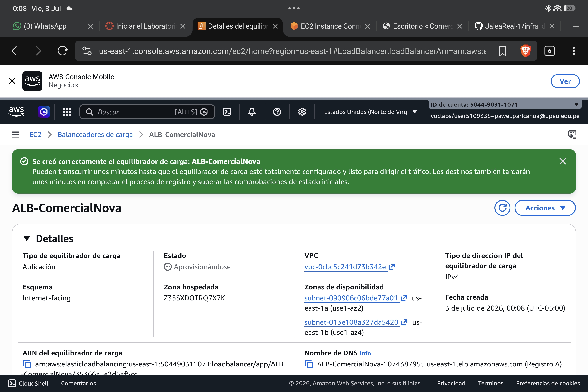
*Figura 15: Despliegue del ALB (`ALB-ComercialNova`) y obtención del DNS público único de acceso[cite: 2].*

---

## 6. CAPA DE OBSERVABILIDAD Y CONTROL DE COSTOS
Monitoreo continuo de las constantes de salud de los recursos virtuales desplegados para anticipar la degradación de infraestructura y mantener la gobernanza económica[cite: 2].

### 6.1 Métricas y Alarmas en Amazon CloudWatch
Se configuró una alarma operacional basada en la métrica `CPUUtilization` con un umbral crítico de disparo estipulado en mayor o igual al 70%[cite: 2].

*Figura 16: Panel Dashboard consolidado para el seguimiento de rendimiento de cómputo y base de datos[cite: 2].*

### 6.2 Gobernanza Financiera (AWS Cost Management / Alternativa)
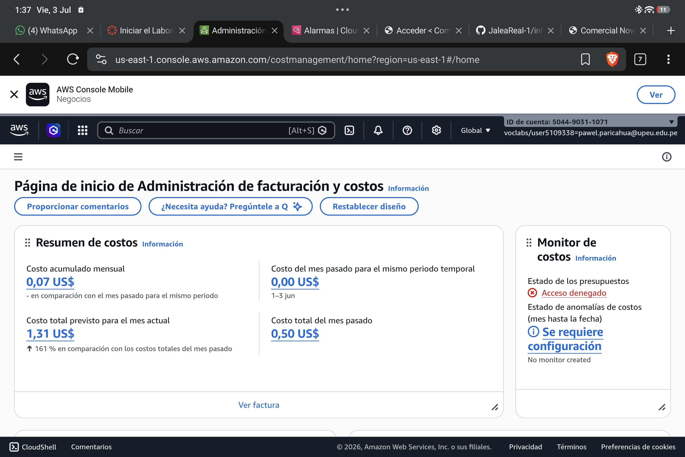
*Figura 17: Captura del panel de control de saldos (Remaining Budget) de la sesión del laboratorio para mitigar sobrecostos[cite: 2].*

#### Acciones Concretas de Optimización Propuestas para Producción:
1. **Estrategia de Rightsizing:** Degradación o migración de componentes a familias de instancias de última generación según las demandas reales del Dashboard[cite: 2].
2. **Ciclos de Vida en Almacenamiento (S3 Lifecycle):** Configurar políticas automáticas para mover archivos multimedia antiguos a la clase *S3 Standard-Infrequent Access (IA)*[cite: 2].
3. **Políticas de Automatización de Encendido/Apagado:** Detener de forma automatizada las instancias EC2 de desarrollo fuera de horario comercial, reduciendo hasta un 30% del gasto en cómputo[cite: 2].

---

## 7. SECCIÓN DE LECCIONES APRENDIDAS (CONCLUSIÓN OBLIGATORIA)
El desarrollo del caso práctico para Comercial Nova validó con rigor de ingeniería los beneficios del aprovisionamiento ágil en la nube en contraste con los centros de datos locales[cite: 2]. La separación física y lógica de la persistencia relacional (RDS) en subredes privadas, gobernada por Security Groups restrictivos, demostró ser la metodología estándar para blindar el núcleo de datos de una compañía[cite: 2].

Asimismo, el despliegue del Application Load Balancer y el uso de imágenes AMI personalizadas permitieron internalizar de manera práctica la resiliencia tecnológica, asegurando que un servicio crítico permanezca en línea de manera ininterrumpida ante fallos puntuales del hardware subyacente[cite: 2]. Finalmente, la integración de herramientas de observabilidad como CloudWatch provee la métrica necesaria para tomar decisiones financieras informadas sobre escalabilidad y Rightsizing[cite: 2].
